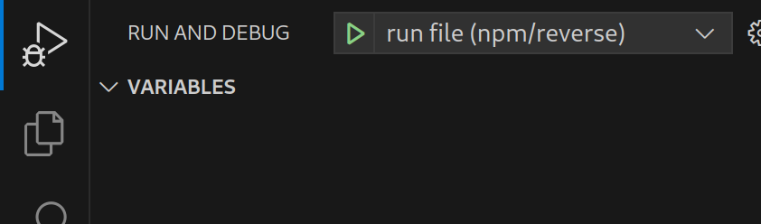

# OpenApi42 Examples

This repository contains examples that you may use as a starting point for using OpenApi42.

## TOC

- reverse, a very minimal API that reverses a string.

  [Specification](specifications/reverse-api.yaml), [Node.js](packages/npm/reverse)

## Node.js (npm)

### Setting up

Make sure you have [Node.js](https://nodejs.org) and npm (included in Node.js) installed on your system. Then, run the following to install and generate everything.

```
npm run initialize
```

This will also trigger the a script that will generate all API code with [oa42-generator](https://github.com/LuvDaSun/OpenApi42).

### Running an example

After setting up, you can run an example by going to it's directory via `npm start`. Also check out the `README.md` of the example for more information.

If you are using vscode, you could also open the workspace file `OpenApi42-Examples.code-workspace` and use the configured launch commands (see [Running a file](#running-a-file)).

All of the Node.js examples are located in the [packages/npm](./packages/npm/) directory.

### Running all tests

We have unit tests! After setting up, run `npm test --workspaces` this will run all unit tests. You will need node v21 or higher for this to work properly!

### Running a file

If you only want to run a single unit test file, then open the [workspace file](./OpenApi42-Examples.code-workspace) in Visual Studio Code. Then pick a unit test (`*.test.ts`) and choose the `run file` option from the launch menu.



Make sure you pick the run file that is in the test project (`npm/reverse` in the image).

Breakpoints are supported!

## Rust (cargo)

Coming (soon?)...
